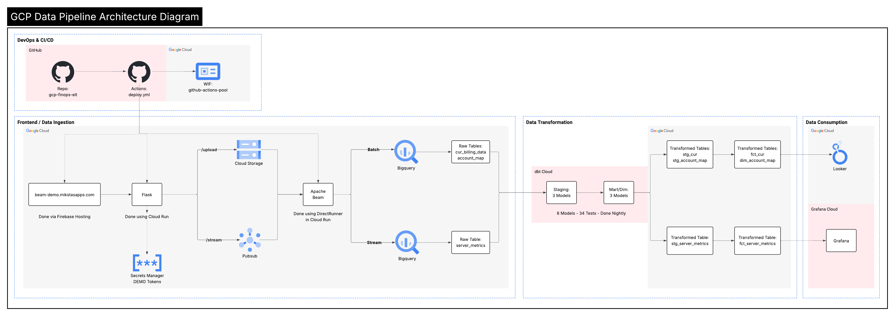
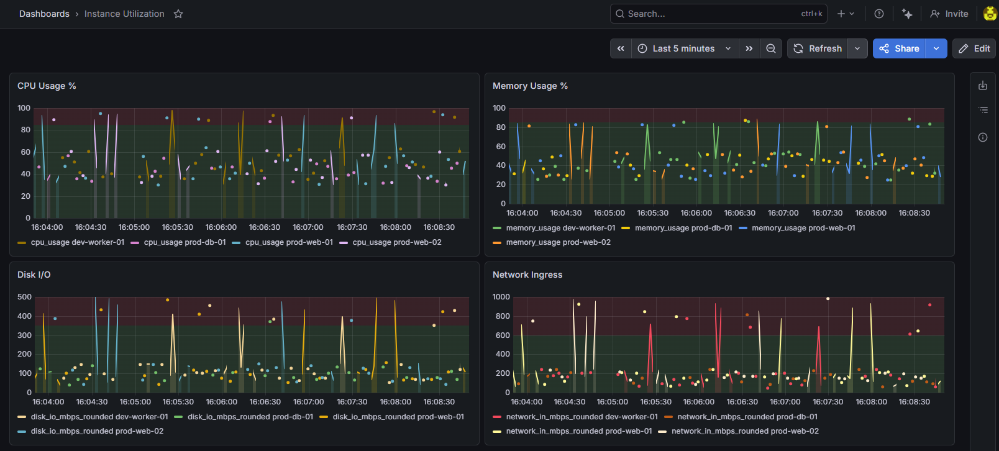
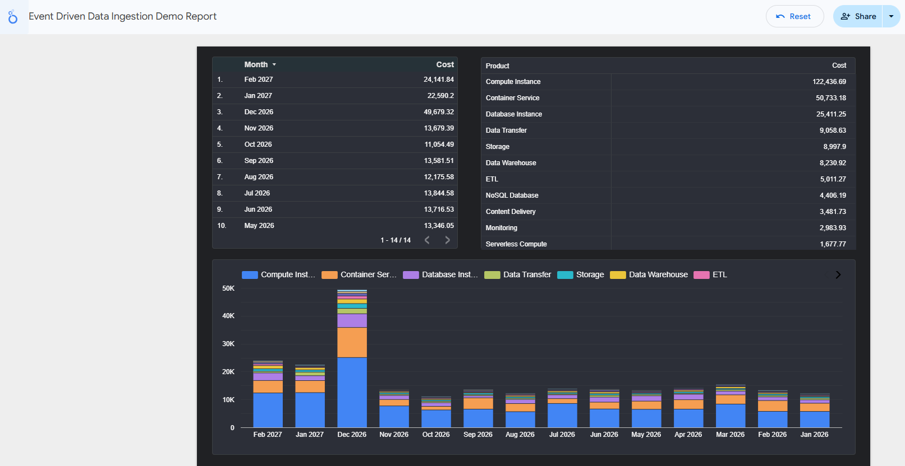
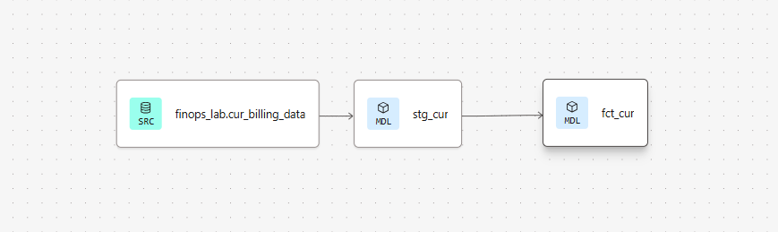
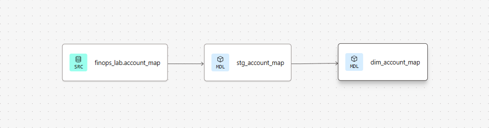
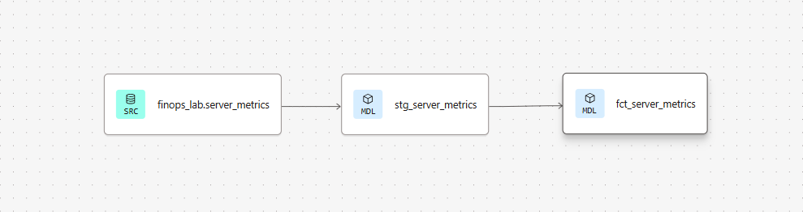
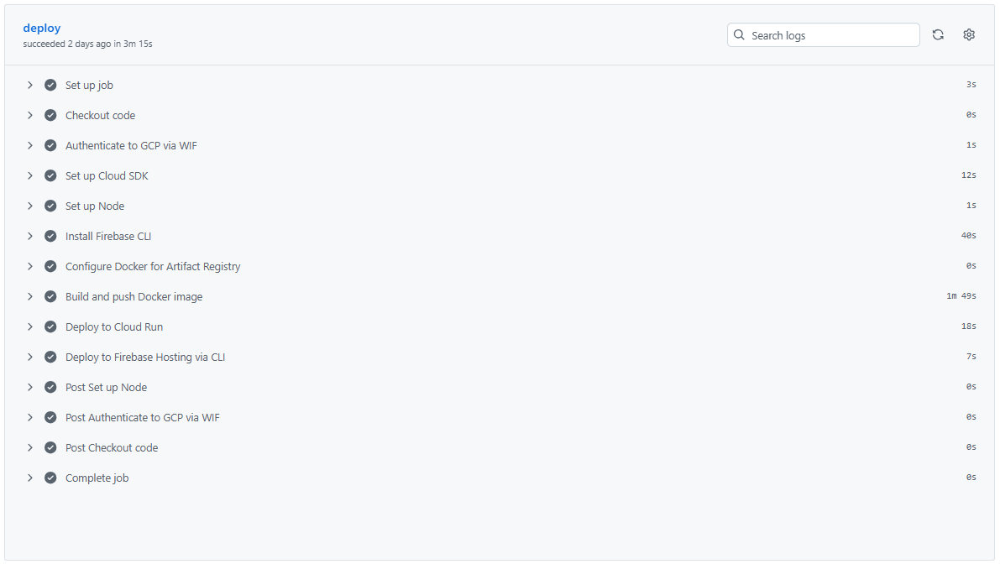

# GCP FinOps ELT Pipeline

A production grade ELT pipeline built to demonstrate end-to-end 
data engineering on Google Cloud Platform. Ingests AWS Cost and 
Usage Report (CUR) billing data and real-time server metrics, 
transforms them through a dbt modeling layer, and surfaces insights 
in Grafana and Looker dashboards.

Built as a portfolio project to showcase data engineering patterns 
including streaming and batch ingestion, automated transformation, 
data quality testing, and CI/CD deployment - all on GCP.

## Tech Stack

| Layer           | Technology                   | Purpose                                                   |
|-----------------|------------------------------|-----------------------------------------------------------|
| Ingestion       | Apache Beam (DirectRunner)   | Batch and streaming data ingestion                        |
| Serving         | Flask + Cloud Run            | HTTP API for file uploads and metric streaming            |
| Messaging       | Google Cloud Pub/Sub         | Real-time metric event delivery                           |
| Storage         | Google Cloud Storage         | Staging area for batch file uploads                       |
| Data Warehouse  | Google BigQuery              | Raw and transformed data storage                          |
| Transformation  | dbt Cloud                    | Data modeling, testing, and documentation                 |
| BI / Dashboards | Grafana Cloud                | Real-time server metrics visualization                    |
| BI / Dashboards | Looker                       | CUR billing data analysis                                 |
| Frontend        | Firebase Hosting             | Static demo page with HTTPS via beam-demo.mikstasapps.com |
| DNS             | Route 53                     | DNS management for mikstasapps.com domain                 |
| CI/CD           | GitHub Actions               | Automated deployment to Cloud Run and Firebase            |
| Auth            | Workload Identity Federation | Keyless GCP authentication from GitHub Actions            |
| Secrets         | GCP Secret Manager           | Secure token storage                                      |
| Version Control | GitHub                       | Source code and infrastructure management                 |
|-----------------|------------------------------|-----------------------------------------------------------|

## Architecture



[View full interactive diagram](https://lucid.app/lucidchart/52f62340-12b4-4977-b87d-32c2a305e691/edit?viewport_loc=1680%2C-3542%2C5637%2C2343%2C0_0&invitationId=inv_39774a61-f97f-448c-b97c-517bcb8508db)

**Ingestion** — A Flask API running on Cloud Run accepts file uploads 
via `/upload` (batch) and server metrics via `/stream` (real-time). 
Batch files are staged in Cloud Storage before being processed by 
Apache Beam. Streaming metrics are published to Pub/Sub and consumed 
by a Beam streaming pipeline running as a background thread within 
the same Cloud Run container.

**Transformation** — Raw BigQuery tables are transformed by dbt Cloud 
into typed, tested, and documented staging and fact/dimension models. 
A nightly scheduled job runs `dbt run` and `dbt test` across all 6 
models and 34 data quality tests.

**Consumption** — Grafana Cloud visualizes real-time server metrics 
via `fct_server_metrics`. Looker surfaces CUR billing insights via 
`fct_cur` and `dim_account_map`.

**CI/CD** — GitHub Actions automatically deploys updates to Cloud Run 
and Firebase Hosting on every push to main, authenticated via 
Workload Identity Federation. No long-lived credentials required.

## Technical Decisions

**Apache Beam with DirectRunner**
The pipeline uses Apache Beam with DirectRunner, which executes 
pipelines locally within the Cloud Run container. This was a 
deliberate choice for a portfolio project. The pipeline code is 
runner-agnostic by design. Migrating to Google Dataflow for 
production scale execution requires no changes to the pipeline 
logic, only a change to the runner configuration.

**dbt Cloud for Transformation**
Raw BigQuery tables use an all-STRING schema at ingestion time to 
ensure pipeline resilience. Malformed data lands safely rather than 
failing the pipeline. dbt handles all type casting, renaming, and 
business logic in a version controlled, tested transformation layer. 
This pattern cleanly separates ingestion concerns from transformation 
concerns.

**Workload Identity Federation over JSON Keys**
GitHub Actions authenticates to GCP using Workload Identity 
Federation rather than long lived service account JSON keys. This 
eliminates the risk of credential exposure in source control and 
follows GCP's recommended keyless authentication pattern for CI/CD 
pipelines.

**BigQuery as the Data Warehouse**
BigQuery was chosen for its native integration with the GCP 
ecosystem, serverless scaling, and excellent support from both 
dbt, Looker and Grafana. The separation of raw tables in `finops_lab` from 
dbt-managed views provides a clear data lineage path from ingestion 
to consumption.

**Dual BI Layer — Grafana and Looker**
Two separate visualization tools were chosen intentionally to 
reflect real-world tooling patterns. Grafana Cloud is used 
for real-time server metrics monitoring, leveraging its native 
support for time-series data and live dashboard refresh. Looker 
is used for CUR billing analysis, where its semantic modeling 
layer and ad-hoc exploration capabilities are better suited to a
cost reporting use cases.

Both tools query dbt-managed fact and dimension models directly, 
ensuring a single source of truth for all downstream consumption.

## CI/CD Workflow

Deployments are fully automated via GitHub Actions and triggered 
on every push to `main` that includes changes to the `pipeline/` 
directory.

**Cloud Run Deployment**
The workflow authenticates to GCP using Workload Identity 
Federation, builds a Docker image from the `pipeline/` directory, 
pushes it to Google Artifact Registry, and deploys the updated 
image to the `finops-beam-pipeline` Cloud Run service. All done without 
storing any GCP credentials in GitHub.

**Firebase Hosting Deployment**
Changes to `pipeline/public/` trigger a separate job that deploys 
the updated static frontend to Firebase Hosting, making 
`beam-demo.mikstasapps.com` the authoritative source for the 
demo interface.

**Workflow File**
The full workflow is defined in `.github/workflows/deploy.yml` 
in this repository.

**Authentication**
| Component             | Auth Method                              |
|-----------------------|------------------------------------------|
| Cloud Run deployment  | Workload Identity Federation (keyless)   |
| Firebase deployment   | Workload Identity Federation (keyless)   |
| dbt Cloud nightly job | Service Account JSON (dbt Cloud managed) |
|-----------------------|------------------------------------------|

## Data Models

All transformations are managed by dbt Cloud and follow a 
two layer modeling pattern: staging models clean and type-cast 
raw source data, and fact/dimension models apply business logic 
for consumption.

### Staging Models
| Model                | Source                        | Description                                                              |
|----------------------|-------------------------------|--------------------------------------------------------------------------|
| `stg_server_metrics` | `finops_lab.server_metrics`   | Casts all STRING columns to typed values, parses ISO 8601 timestamps     |
| `stg_cur`            | `finops_lab.cur_billing_data` | Casts cost to FLOAT64, parses usage dates, renames columns to snake_case |
| `stg_account_map`    | `finops_lab.account_map`      | Cleans and standardizes account metadata                                 |
|----------------------|-------------------------------|--------------------------------------------------------------------------|

### Fact and Dimension Models
| Model                | Type      | Description                                                                             |
|----------------------|-----------|-----------------------------------------------------------------------------------------|
| `fct_server_metrics` | Fact      | Adds derived metrics (rounded values, metric_date, metric_hour) for Grafana consumption |
| `fct_cur`            | Fact      | Adds service categorization, usage month rollup, filters credits                        |
| `dim_account_map`    | Dimension | Adds `is_production` boolean flag for downstream filtering                              |
|----------------------|-----------|-----------------------------------------------------------------------------------------|

### Data Quality
All models include `not_null` tests on critical columns. 
`dim_account_map` additionally enforces a `unique` constraint 
on `account_id` to guarantee referential integrity. Tests run 
automatically as part of the nightly dbt job; 34 tests total 
across all models and source tables.

## Setup & Usage

### Prerequisites
- Google Cloud Platform project with billing enabled
- Python 3.11+
- Docker
- Firebase CLI (`npm install -g firebase-tools`)
- dbt Cloud account (free tier)
- Grafana Cloud account (free tier)

### Environment Variables
The following environment variables must be configured in your 
Cloud Run service:

| Variable             | Description                                    |
|----------------------|------------------------------------------------|
| `BQ_PROJECT`         | GCP project ID                                 |
| `BQ_DATASET`         | BigQuery dataset name                          |
| `PROJECT_ID`         | GCP project ID for Pub/Sub                     |
| `TOPIC_ID`           | Pub/Sub topic name                             |
| `SUBSCRIPTION_ID`    | Pub/Sub subscription name                      |
| `DESTINATION_BUCKET` | GCS bucket name for file uploads               |
| `PRIMARY_TOKEN`      | API auth token (stored in Secret Manager)      |
| `DEMO_TOKEN`         | Demo API auth token (stored in Secret Manager) |
|----------------------|------------------------------------------------|

### Running Locally
```bash
cd pipeline
pip install -r requirements.txt
python main.py
```

### Deploying to Cloud Run
Deployments are handled automatically via GitHub Actions on 
push to `main`. To deploy manually:
```bash
gcloud run deploy finops-beam-pipeline \
  --source ./pipeline \
  --region us-west3 \
  --platform managed
```

### Deploying the Frontend
```bash
cd pipeline
firebase deploy --only hosting --project your-project-id
```

### dbt Setup
1. Connect dbt Cloud to this repository
2. Set the project subdirectory to `dbt/`
3. Configure a BigQuery connection using a service account
4. Run `dbt run` and `dbt test` to verify the setup
5. Configure a nightly deploy job using the schedule `0 2 * * *`

## Screenshots

### Grafana Dashboard — Real-Time Server Metrics


### Looker Dashboard — CUR Billing Analysis


### dbt Lineage Graphs




### GitHub Actions — Successful Deployment


## Roadmap

- **Dataflow Migration** — Replace DirectRunner with Google Dataflow 
for production scale distributed pipeline execution. The pipeline 
code requires no changes, only the runner configuration.

- **Terraform** — Infrastructure as Code for all GCP resources 
including BigQuery datasets, Cloud Run services, Pub/Sub topics, 
GCS buckets, and IAM bindings.

- **GitHub Actions Optimization** — Implement path-based conditional 
steps to avoid rebuilding and redeploying unchanged components on 
every push.

- **dbt Source Freshness** — Add `dbt source freshness` checks to 
the nightly job to alert when source tables have not been updated 
within expected intervals.

- **Workload Identity Federation for dbt Cloud** — Potentially replace 
the current Service Account JSON key with WIF authentication for dbt 
Cloud's BigQuery connection, eliminating this long-lived credential 
from the stack. Ticket was submitted to dbt support and currently 
requires Entra ID and OAUTH and is an enterprise feature. Will review 
later to see if this becomes a mainstream feature.

- **Alerting** — Integrate dbt Cloud webhook notifications with 
Slack to alert on nightly job failures or data quality test 
failures.